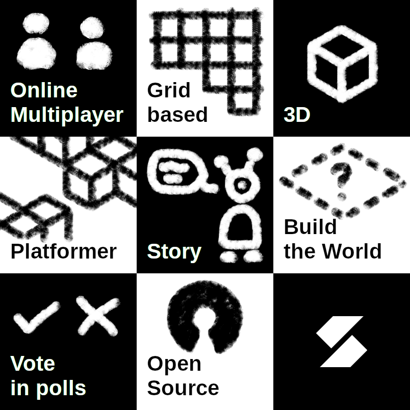

# Suffragium
A game developed in a democratic cycle.

We are building a grid-based online multiplayer 3d platformer. You will be able
to build parts of the world, jump, run, vote in democratic polls, explore,
collect, talk to villagers and have fun!

## Contribute
Everyone can participate in this project. Just open a pull request for a feature
you’d like to be added. The community decides, if your PR gets merged.

Look into [CONTRIBUTING](https://github.com/letsgamedev/Suffragium/blob/main/CONTRIBUTING.md#contributing-to-suffragium)
for more information.

## Background
If you want to find out, how things started, you can watch watch
[this *german* video on YouTube](https://www.youtube.com/watch?v=IyOwaiQkkic).
Trust me, it's not a rick roll. Or is it?
